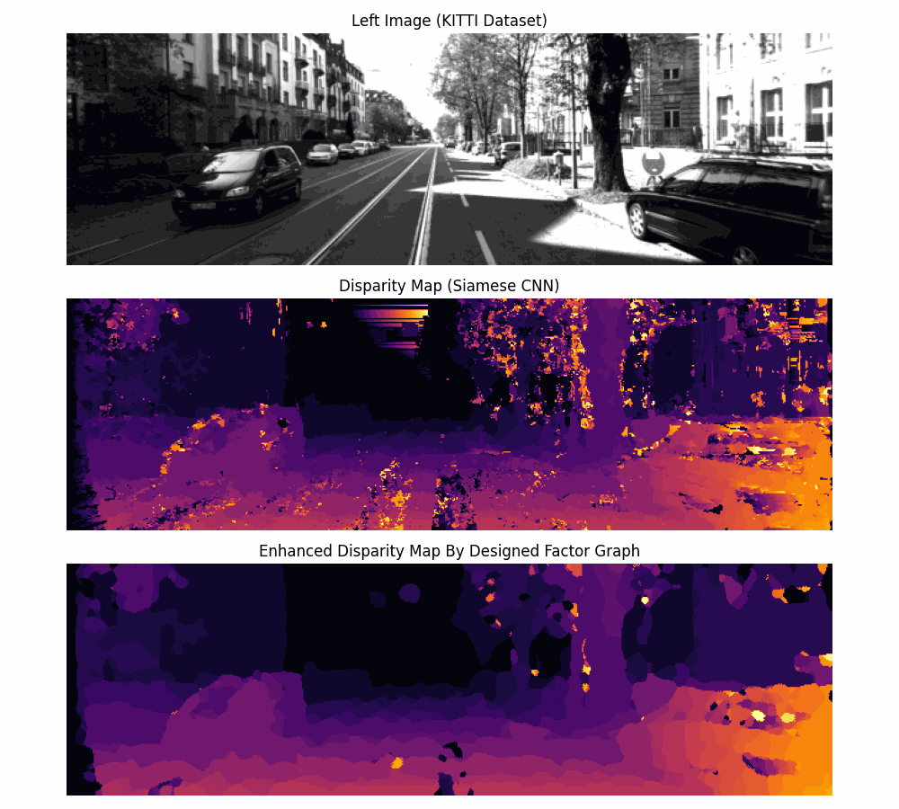

# Depth/Stereo Map Reconstruction with Factor Graph and Loopy Belief Propagation Maximum A Priori Estimation

  

 

This repository focuses on enhancing disparity maps generated by algorithms such as block matching methods through the utilization of prior knowledge about the nature of disparity maps. By incorporating graphical probabilistic models (PGMs) like Factor Graphs, we improve the accuracy of disparity estimations.

The code within this repository creates a `Factor Graph` resembling the provided diagram. It models each pixel's disparity as a random variable with integer values ranging from 0 to the maximum disparity value. These variables are linked through four factors corresponding to their 4-connected neighbors, promoting smoothness among adjacent pixels.

Factors are designed with the scene in mind, accounting for expected gradual disparity changes within objects and sharper changes at object edges. Unary factors align the variable's value with the input disparity map, enhancing consistency.

The `factors_depth_reconstruction.py` file contains a class for initializing the Factor Graph and employing `Maximum A Priori Estimation` through `Loopy Belief Propagation Maximum A Posteriori`.

After refinement, the quality of disparity maps significantly improves, minimizing artifacts. The initial disparity maps are generated by this repository: [Siamese CNN for Block Matching in Stereo Images Depth Mapping](https://github.com/farhad-dalirani/Siamese-Net-Stereo-Depth).

  

 

Please see the `run.py` file for usage of this algorithm, it contains an example involving `FactorGraphDepthReconstruction` class and the `loopy_belief_propagation_maximum_a_posteriori` method.